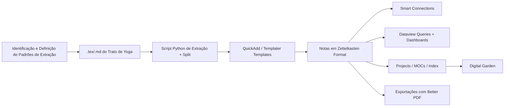

---

## title: "Pipeline de Processamento para Vault Obsidian com Zettelkasten" created: 2025-04-18 source: Trato de Yôga do Mestre De Rose zettel-type: structure

# 👻 Fluxo de Trabalho Ideal para Processamento e Publicação no Obsidian

## 🔹 Visão Geral do Pipeline



## ⚙️ Etapas Detalhadas do Processo

### 1. 🧼 Identificação e Definição de Padrões

- Criar um **template de prompt** para ler arquivos `.md`/`.tex` e **identificar os padrões de divisão**.
    
- Definir: assunto, aplicação, tipo de cabeçalhos, subtítulos, quebras lógicas.
    

### 2. 🚧 Pré-processamento com Python

- Ler o `.md` vindo do LaTeX (`YOGA_R00.md`)
    
- Separar por seções baseadas em `#`, `##`, ou regex (ex: `\section`, `\subsection`)
    
- Criar arquivos `.md` com frontmatter como:
    

```yaml
dg-publish: true
---id: 20250418T123456Z
title: Kundaliní
tags: [#type/note, #theme/yoga, #source/trato-yoga]
zettel-type: atomic
related: [[Chakras]], [[Respiração]]
created: 2025-04-18
---
```

- Salvar automaticamente em `/Zettels/`
    

### 3. ⚡️ Automatização com QuickAdd + Templater

- Criar nota via comando:
    

```markdown
<%*
let now = new Date();
let id = tp.date.now("YYYYMMDDTHHmmss");
-%>
---
id: <%= id %>
title: <% tp.file.title %>
tags: [#type/note, #source/trato-yoga]
zettel-type: atomic
created: <%= now.toISOString().split("T")[0] %>
---

## 🌱 Resumo

## 🧠 Insight

## 🔗 Relacionado
```

### 4. 🔗 Smart Connections

- Rodar após certo volume de notas
    
- Gerar sugestões automáticas de links internos
    
- Anotar padrões, sinônimos e recorrências relevantes
    

### 5. 📊 Dataview Queries

```dataview
TABLE title, tags, related
FROM "Zettels"
WHERE contains(tags, "#theme/yoga")
SORT file.name ASC
```

### 6. 🗂️ Projects e MOCs

- Criar Mapas Conceituais por tema ou tópico
    
- Criar notas estruturais `Structure: Tipos de Yôga`, `Structure: Filosofia Oriental`
    
- Integrar com plugin Projects para planejamento de revisões e expansões
    

### 7. 🌐 Publicação com Digital Garden

```yaml
publish: true
dg-path: "filosofia/derose-method"
```

### 8. 📄 Exportação com Better Export PDF

- Geração de relatórios em PDF estilizados a partir das notas
    

### 9. 🧠 Enriquecimento com Wikipedia + Book Search

- Complementar informações com contexto histórico e bibliográfico
    

---

## 🌐 Taxonomia de Tags

### 🔹 Tipos de Tags

|Tipo|Exemplo|Função|
|---|---|---|
|`#type/`|`#type/note`, `#type/literature`|Define o tipo da nota|
|`#source/`|`#source/book`, `#source/trato-yoga`|Indica a origem|
|`#theme/`|`#theme/yoga`, `#theme/filosofia`|Tema conceitual|
|`#status/`|`#status/draft`, `#status/final`|Estado de desenvolvimento|
|`#target/`|`#target/book`, `#target/blog`|Destino/intencionalidade|

### 🔹 Checklist de Tags

- `#type/` para classificar a nota
    
- `#theme/` para agrupar por tema
    
- `#source/` para rastrear a origem
    
- `#target/` para planejamento de entrega
    

---

## ✅ Checklist Operacional

| Etapa                               | Ferramenta/Plugin | Status |
| ----------------------------------- | ----------------- | ------ |
| Identificar padrões no `.md`        | Prompt + Python   | 🔲     |
| Script Python de Split e Formatação | 🐍 Python + Regex | 🔲     |
| Template para QuickAdd e Templater  | Obsidian          | 🔲     |
| Geração em lote de Zettels          | Python            | 🔲     |
| Dashboard com Dataview              | Obsidian          | 🔲     |
| MOC com Projects                    | Obsidian          | 🔲     |
| Smart Connections ativado           | Obsidian          | 🔲     |
| Integração com Digital Garden       | GitHub Pages      | 🔲     |