Excelente pergunta, Pedro! Vamos organizar isso por partes, como você gosta: com **explicações profundas, tabelas comparativas e passo a passo prático**. A proposta aqui é te mostrar o valor do **Zotero**, compará-lo com o **NotebookLM (ex-NotebookLLM)** e mostrar como **integrá-lo ao seu sistema com o Obsidian**, otimizando sua produtividade e estrutura de estudos/pesquisas.

---

## 📚 1. O que é o **Zotero**?

O **Zotero** é um **gerenciador de referências e bibliografia**, open-source, criado para facilitar:

- Coleta de artigos, livros, documentos e websites com metadados
    
- Organização por pastas e tags
    
- Citação automática (em Word, LibreOffice, Google Docs etc.)
    
- Geração de bibliografias em dezenas de estilos (APA, ABNT, IEEE…)
    
- Armazenamento de PDFs e anotações
    
- Sincronização entre dispositivos
    

---

## 🧠 2. O que é o **NotebookLM**?

O **NotebookLM (ex-NotebookLLM)** é uma ferramenta da Google, ainda em versão experimental, que funciona como um "Google Docs + LLM", ou seja:

- Você **insere textos, PDFs, docs** dentro de notebooks
    
- Ele cria um **modelo mental de tudo que você adicionou**
    
- Você pode conversar com o conteúdo como se fosse um ChatGPT privado
    
- Ele **entende e referencia suas notas**, permitindo respostas com fontes
    

> ⚠️ Ele **não é um gerenciador de referências tradicional** como o Zotero, e sim uma ferramenta de **consultas inteligentes com IA**.

---

## 🔍 3. Tabela Comparativa: Zotero vs NotebookLM

|Característica|**Zotero**|**NotebookLM (Google)**|
|---|---|---|
|Tipo de Ferramenta|Gerenciador de referências|Assistente IA com base em notebooks|
|Armazenamento de PDFs|✅ Sim, com OCR|✅ Sim, mas foco em leitura com IA|
|Geração de Citações/Bibliografia|✅ Sim (APA, ABNT etc.)|❌ Não é feito para citação acadêmica|
|Tags e Classificação|✅ Avançado, com pastas e coleções|❌ Básico (notebooks apenas)|
|Capacidade de Resumo/Interpretação|❌ (sem IA nativa)|✅ IA generativa com compreensão de texto|
|Integração com Obsidian|✅ Várias formas (Zotero Integration, MD Notes)|❌ Não possui integração direta|
|Offline|✅ Sim|❌ Necessita conexão|
|Open-source|✅ Sim|❌ Não (Google Labs)|

---

## 🧩 4. Como **integrar o Zotero com o Obsidian**?

A ideia aqui é usar o Zotero para coletar e organizar sua bibliografia, e **transformar tudo em notas legíveis dentro do Obsidian**, em formato Markdown, com links e backlinks.

### ✅ Passo a Passo – Integração Zotero + Obsidian

---

### Etapa 1 — Instale os componentes necessários

|Item|Instrução|
|---|---|
|**Zotero**|Baixe em [zotero.org](https://www.zotero.org/)|
|**Zotero Connector**|Extensão do navegador para capturar referências com um clique|
|**Better BibTeX for Zotero**|Plugin obrigatório para exportar dados de forma automatizada|
|**MDNotes** _(opcional)_|Plugin Zotero para exportar PDFs e anotações em Markdown|
|**Obsidian**|Já instalado, mas você precisará do plugin “Zotero Integration”|

---

### Etapa 2 — Configure o **Better BibTeX**

1. No Zotero, vá em **Preferências > Exportação > Better BibTeX**
    
2. Configure o **caminho do arquivo `.bib`**, por exemplo:
    
    ```
    C:\Users\Pedro\ObsidianVault\Bibliografia\minhas-referencias.bib
    ```
    
3. Marque a opção **"Exportar automaticamente"**
    

---

### Etapa 3 — No Obsidian

1. Instale o plugin **Zotero Integration** (community plugins)
    
2. Vá em “Settings > Plugins > Zotero Integration” e configure:
    
    - Caminho para o `.bib` gerado
        
    - Caminho para os PDFs (caso queira links diretos)
        
3. Agora você pode usar o comando `Citar` (via comando de paleta) e ele vai buscar direto no Zotero
    
4. Você também pode gerar fichamentos automáticos, por exemplo:
    

```markdown
> [!quote] Citação automática
> "Texto da citação" (Autor, Ano)
```

---

### Etapa 4 — Exportar PDFs e Anotações

Se você utiliza o **MDNotes**, ele pode:

- Exportar as **anotações feitas no Zotero em Markdown**
    
- Criar links automáticos entre autores, temas e obras
    
- Transformar suas leituras em notas interligadas com Obsidian
    

---

## 🧠 5. Como tudo isso se conecta?

Imagine o seguinte fluxo de trabalho:

```mermaid
flowchart LR
    A[Pesquisa Acadêmica] --> B[Captura com Zotero Connector]
    B --> C[Organização no Zotero]
    C --> D[Exportação .bib com BetterBibTeX]
    D --> E[Obsidian com Zotero Integration]
    C --> F[Exportação de Anotações com MDNotes]
    F --> E
    E --> G[Notas interligadas em Zettelkasten ou MOCs]
```



---

## 📌 6. E quanto ao **NotebookLM**? Quando usar?

Use o **NotebookLM** quando:

- Você precisa **entender profundamente um conjunto de documentos**
    
- Quer **fazer perguntas em linguagem natural** com suporte de IA
    
- Está estudando um **grande PDF ou livro técnico**
    
- Precisa de **resumos automáticos e explicações com contexto**
    

Use o **Zotero + Obsidian** quando:

- Você precisa **organizar bibliografias**
    
- Está fazendo **pesquisas acadêmicas**
    
- Deseja criar um **sistema durável de notas conectadas**
    
- Está seguindo o método **Zettelkasten, MOCs ou Smart Notes**
    

---

## ✅ Conclusão

📘 **Zotero é fundamental para qualquer trabalho acadêmico ou técnico sério.**  
🧠 **NotebookLM é ótimo para estudar com IA de forma rápida e exploratória.**  
🪄 **Obsidian une os dois mundos, permitindo um sistema de conhecimento pessoal com automações e poder de interligação.**

Se quiser, posso gerar um template para **integração entre o Zotero e o Obsidian**, ou configurar um **sistema completo com links, tags e pastas para você começar**. Quer que eu prepare isso?